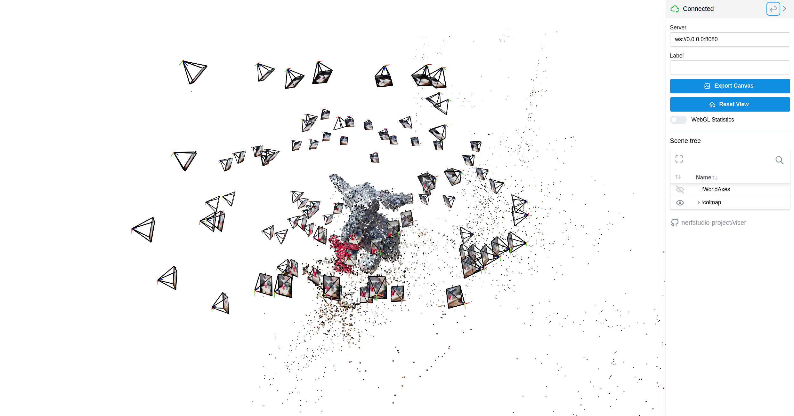

# lighthloc - A light and fast implementation of hloc with TensorRT

## Data preparation
Place your images in the images/ folder. The structure of your data should be as follows:
```
-data_001
    -images
-data_002
    -images
-data_003
    -images
```
Each separate data folder houses its own images folder.

## How to Use
### Start in 1 Step
We provide prebuilt Docker images for running light-hloc in one step.
```
docker run -v ${INPUT_DIR}:/data docker.io/hugoycj/light-hloc
```
In the script, `${INPUT_DIR}` should be replaced with the actual directory path where your data is located. The output `sparse` folder will be saved under INPUT_DIR

A toy example is provided for testing, start by running the following command: `docker run -v $(pwd)/examples/elephants:/data docker.io/hugoycj/light-hloc`

### Build from Source
#### Installation
`hloc` requires Python >=3.7 and PyTorch >=1.1. Installing the package locally pulls the other dependencies:

```bash
git clone --recursive https://github.com/hugoycj/light-hloc
cd lighthloc/
pip install --upgrade pip setuptools
pip install -e .
```

#### Custom your pipeline
We have a convient shell command similar to `ns-process-data` in `nerfstudio`:
```
Usage: hloc-process-data [OPTIONS]

Options:
  --data TEXT                     Path to data directory
  --match-type [exhaustive|sequential|retrival]
                                  Type of matching to perform (default:
                                  retrival)
  --feature-type [superpoint_inloc|superpoint_aachen]
                                  Type of feature extraction (default:
                                  superpoint_inloc)
  --matcher-type [lightglue|lightglue_trt|superglue]
                                  Type of feature matching (default:
                                  lightglue)
  --mapper-type [default|fast]    Type of mapper (default: default)
  --help                          Show this message and exit.
```

#### Use Cases

1. If you are seeking a balance between speed and accuracy, we recommend using the following command. This configuration is optimized for faster processing while still maintaining satisfactory accuracy.
    ```
    hloc-process-data --data ${INPUT_DIR} --feature-type superpoint_aachen --match-type retrival --matcher-type lightglue
    ```
2. **If your input data is extracted from a sequential video and your primary concern is speed**, we recommend the following command:
    ```
    hloc-process-data --data ${INPUT_DIR} --feature-type superpoint_aachen --match-type sequential --matcher-type lightglue --mapper-type fast
    ```
    Using the "sequential" feature type can help expedite the processing time while still providing reasonable results.

3. *An experimental version of **TensorRT-accelerated LightGlue** has been provided. However, the overall efficiency is currently poor due to the time required to transfer intermediate data from the GPU to the CPU and then convert it to ONNX tensor. There is potential for improvement in the future, which could boost efficiency.*
    ```
    hloc-process-data --data ${INPUT_DIR} --feature-type superpoint_aachen --match-type sequential --matcher-type lightglue_trt
    ```

### Visualize reconstruction results
We provide a remote viewer powered by [viser]() for visualizing data on the server without GUI
```
hloc-view --data ${INPUT_DIR}
```


## TODO
- [x] Add remote viewer to visualize sfm results
- [ ] Add spatial assotiators based on GPS information
- [ ] Add option to use Pixel Perfect SFM